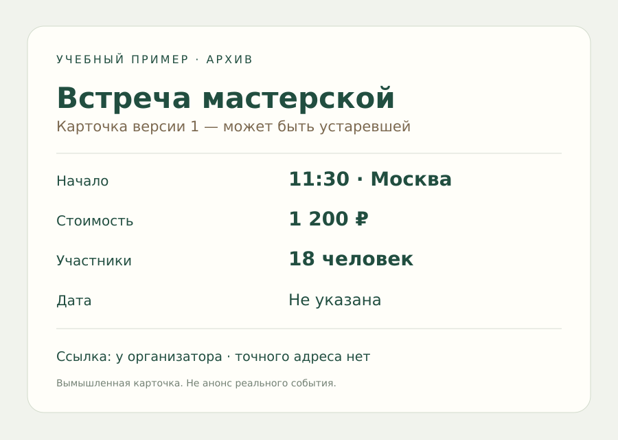

# От голосовой заметки к собственному AI-инструменту

**Четыре связанных блока, 16 занятий и один учебный проект.** Вы научитесь проверять то, что ИИ услышал и увидел, соберёте небольшое приложение, попробуете локальную модель и сравните способы организации работы.

**[Начать с голоса: 20–30 минут, можно с телефона](01-multimodal/01-voice.md).** Нужна только собственная короткая запись по готовому сценарию. Сложные инструменты появятся постепенно.

| Блок | Для кого | Что получится |
|---|---|---|
| [1. Голос, изображения и короткое видео](01-multimodal/README.md) | Уже умеете писать в чат | Проверенная карточка с источниками и неизвестными полями |
| [2. Свой небольшой AI-инструмент](02-product/README.md) | Хотите превратить навык в приложение | Локальная «Сверка» с вводом, цитатами и экспортом |
| [3. Локальная модель](03-local/README.md) | Есть подходящий компьютер | Собственный проверенный запуск и сравнение качества |
| [4. Один исполнитель или несколько ролей](04-teams/README.md) | Умеете проверять AI-результат | Контролируемый эксперимент с затратами на координацию |

## Общий сюжет

Вы получили старую карточку встречи и новое устное уточнение. В уточнении есть оговорки, исправления и неизвестная дата. Задача — не потерять смысл при передаче: запись → текст → карточка → приложение → другой исполнитель.

Все имена, суммы и обстоятельства вымышлены. Личные записи для старта не нужны. [Учебные исходники и разбор](fixtures/README.md).

## Можно выбрать свой темп

- **С телефона:** первый блок и бумажный прототип второго. Локальный Python-сервер требует компьютера.
- **Хочу быстро увидеть приложение:** [запуск демо](lab/README.md) без API-ключа и скачивания модели.
- **Уже программирую:** первый блок как диагностика, затем приложение и расширения.
- **Хочу локальные модели:** начните с проверки устройства; покупать новое оборудование ради курса не требуется.

Основной ориентир — 18–29 часов на четыре блока; фактическое время зависит от установки, устройства и выбранных расширений. Это оценка до пилота. [Подробный план и уровни завершения](CURRICULUM.md).

## Что находится в репозитории

Пошаговые занятия, PNG и исходный SVG, сценарий собственной записи, восемь контрольных случаев, приложение на Python и обычном HTML/JS, адаптер Ollama, шаблоны и программа сравнения записанных результатов. Приложение работает с текстом; распознавание аудио и изображений выполняется отдельно в первом блоке.

Демо использует готовый учебный разбор. Для произвольных заметок нужен подключённый Ollama и совместимая модель. Реальное модельное качество, распознавание голоса, пилот участников и полный браузерный прогон не объявляются проверенными. [Точные результаты проверки](VALIDATION.md).

[Источники](SOURCES.md) · [Если что-то не получается](TROUBLESHOOTING.md) · [Словарь](GLOSSARY.md) · [К предыдущим миссиям](../practical/README.md) · [На главную](../README.md)

Версия 0.6 · 23.09.2026. Независимая программа на русском языке.
